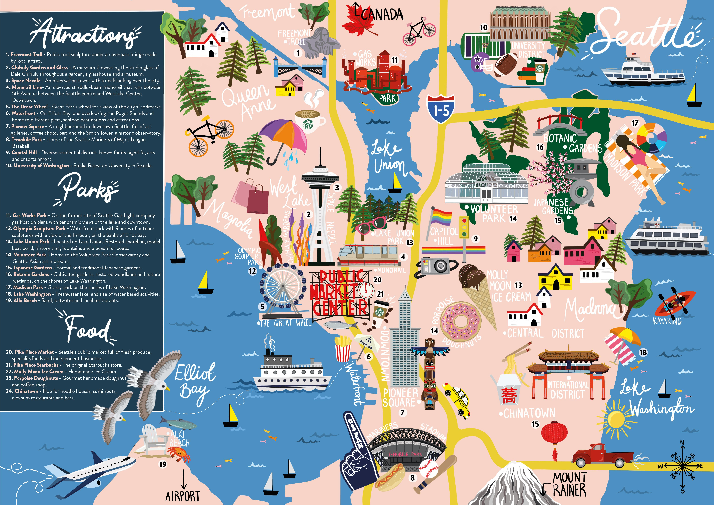
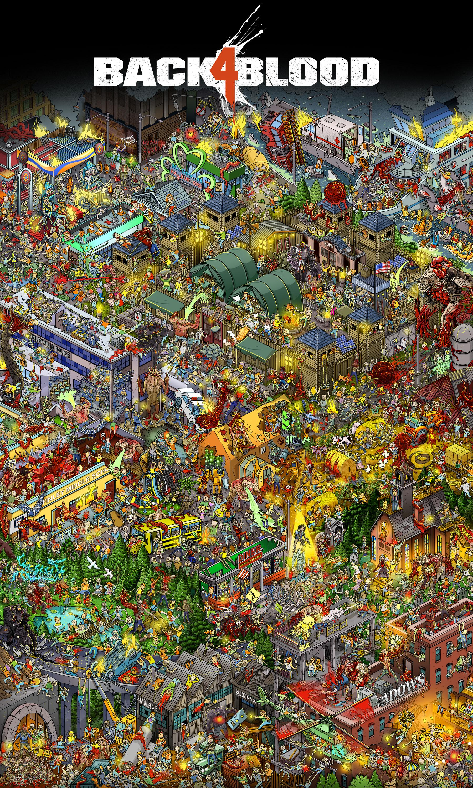
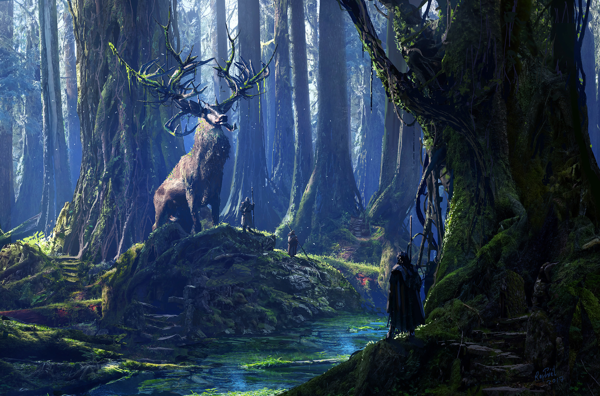
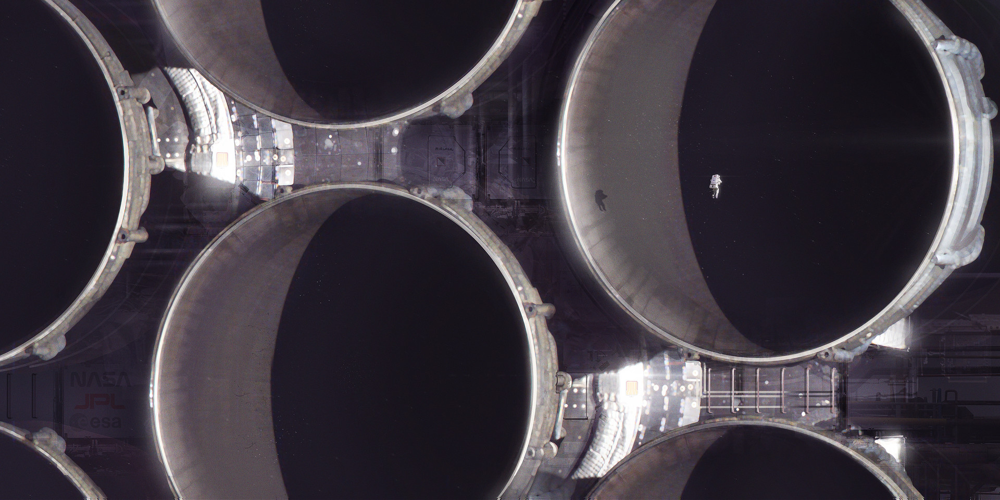
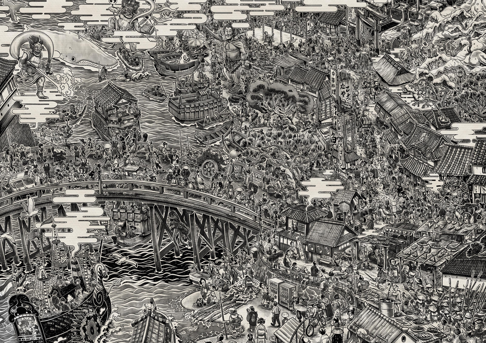
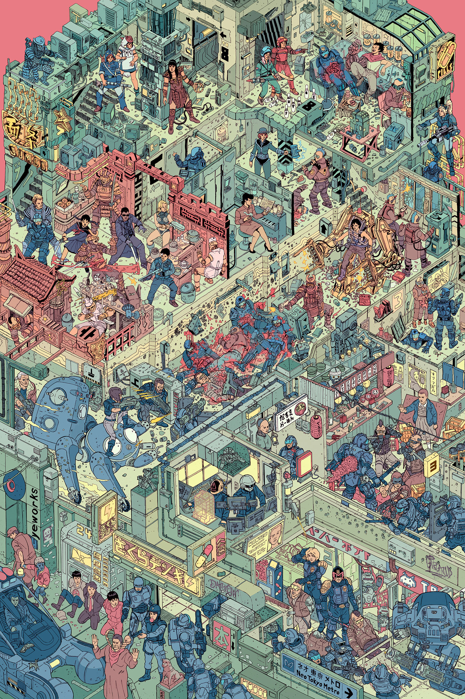
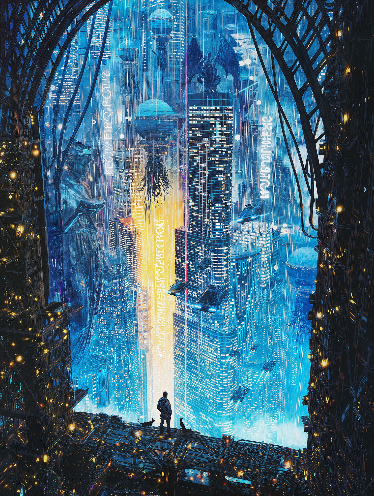
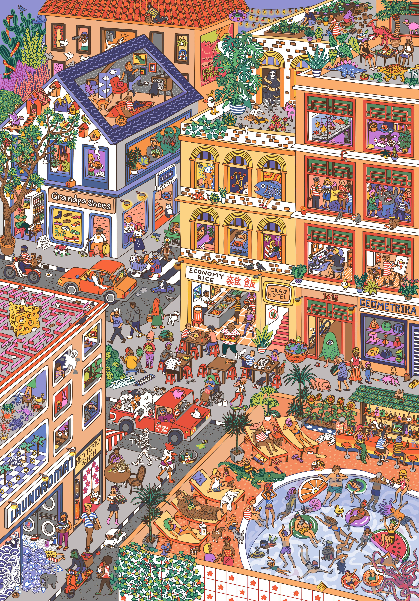

# Puzzle Pics

I use these pictures for jigsaw puzzles on Tabletop Simulator (Jigsaw Join 2). Multiplayer sessions require non-local links, hence these images are hosted on Github.

## Classics 

| Title                 | Artist                                                   | Preview                                                                                                                                                                                                   |
| --------------------- | -------------------------------------------------------- | --------------------------------------------------------------------------------------------------------------------------------------------------------------------------------------------------------- |
| Jean-Leon Gerome      | _Bonaparte Before the Sphinx_                            |                                          |
| John Martin           | _Joshua Commanding The Sun to Stand Still Before Gibeon_ |  |
| Vincenzo Camuccini    | _La Morte di Cesare_                                     |                                                        |
| Emanuel Leutze        | _Washington Crossing The Delaware_                       |                                    |
| John Singleton Copley | Watson and the Shark                                     |                                              |

---

## Maps

| Title   | Artist        | Preview                                                                                 |
| ------- | ------------- | --------------------------------------------------------------------------------------- |
| Bayport | Morgan Girvin |    |
| Unknown | Manhattan     |      |
| Unknown | Seattle Map   |  |
| Tom Crestodina | Washington Ferry |  | 
| Remi Desprit | World Map |  | 
---

## [Morgan Girvin](https://morgangirvin.com/film-posters)

| Title | Preview | 
| - | - | 
| Akira |  | 
| Anatomy of a Dog |  | 
| Batman Returns |  | 
| The Batman |  | 
| Dawn At the Snicket |  | 
| Dredd |  | 
| End of the Line Club |  | 
| Fitznebula Parkway |  | 
| The Grand Budapest Hotel |  | 
| Home Alone |  | 
| Jak and Daxter |  | 
| Kill Bill, Vol. 1 |  | 
| Last Night in Soho |  | 
| Layover in Tar'hai IV |  | 
| Mr. Robot |  | 
| The Nightstand |  | 
| Reservoir Dogs |  | 
| The Seafloor Cinema |  | 
| Snowpiercer |  | 
| Spaced Out |  | 
| Stairs, Stairs, Stairs |  | 
| The Station Doesn't Sleep |  | 
| Taskmaster |  | 
| Untitled |  | 
| Welcome to Goo Lagoon |  | 
| Willy Wonka and the Chocolate Factory |  | 

---

## Other

| Artist | Title | Preview | 
| - | - | - | 
| Unknown | Back 4 Blood |  | 
| Raphael LaCoste | Cerrunos and his Druids |  | 
| Unknown | Complex Routine |  | 
| Unknown | Cyberpunk Cityscape |  | 
| Mac Rebiz | Engine Maintenance |  | 
| Unknown | Food Shops |  |
| Unknown | Greek Mythology |  | 
| Unknown | Insurrection Maze |  | 
| Unknown | Intergalactic Veterinarian |  | 
| Unknown | Lost in Edo |  | 
| Michelle Boggess | Paper Airplane Maze |  | 
| Josan Gonzalez | The Raid |  | 
| Dom McKenzie | Rom Com |  | 
| -- | r/place (2022) |  | 
| Gal Barkan | The Rift |  | 
| Unknown | Tokyo Cityscape |  | 
| Unknown | Where Is John Oliver? |  | 
---
 
## Zurgetron

| Title | Preview | 
| - | - | 
| Busy Street Scene |  | 
 | Concrete Jungle|  | 
 | Crumbling Creek |  | 
| Cybergunk |   | 
| Halls of the Mad King |   | 
| Midnight Metropolis |   | 

